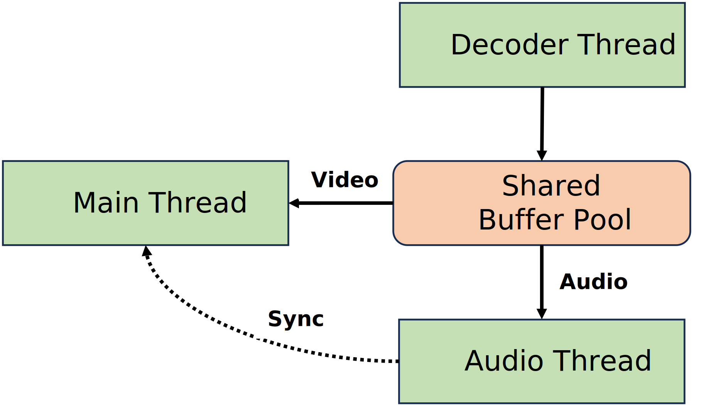

# JsPlayer

https://github.com/kyeongwoon/JsPlayer

This project was inspired by http://dranger.com/ffmpeg/, and referenced the updated code from https://github.com/rambodrahmani/ffmpeg-video-player.



Creating a simple media player using only Node.js involves addressing several challenges. 

### Media Decoder

1. **Decoding Library Selection:**
   - The choice of a suitable video/audio decoding library is crucial for robust media playback.
   - Consideration of libraries capable of working in a multi-threaded environment is essential.

2. **FFmpeg Integration with Rust Neon:**
   - While FFmpeg is a powerful tool, its integration into Node.js often requires a bridge for native performance.
   - Leveraging Rust Neon streamlines the process, allowing for selective importation of necessary FFmpeg APIs into the Node.js environment.

3. **Decoding in Separate Thread:**
   - The decision to execute decoding tasks in a separate WebWorker ensures smoother playback by preventing temporary pauses.
   - Utilizing the messaging system between the main thread and the decoder enhances communication efficiency.

4. **Memory Management Strategies:**
   - SharedArrayBuffer facilitates seamless buffer exchange between threads, crucial for effective communication.
   - The implementation of a Circular Buffer manages decoding and playing offsets, preventing potential memory leaks during extended media playback sessions.

### Sound Output

1. **Node.js Package Limitations:**
   - The absence of comprehensive sound output packages for Node.js necessitates creative solutions.

2. **Choosing OpenAL over SDL Audio:**
   - Binding to SDL Audio is an option, but complexities arise due to memory management issues with callback functions.
   - OpenAL's non-callback structure and support for a separate thread make it a more suitable choice for sound output in the Node.js environment.

### Video Output

1. **Graphics Binding Challenges:**
   - Creating a graphical window within Node.js involves challenges, as there is no standard graphics API.

2. **Selecting Canvas API and wgpu-based Porting:**
   - Choosing the Canvas API for 2D graphics provides a familiar interface within the JS community.
   - Opting for wgpu-based porting ensures compatibility with the Windows system and future upgrades.

### Media Player

**Implementation Strategy:**
   - Drawing inspiration from "An FFmpeg and SDL Tutorial," the implementation of a simple media player in JS language becomes more attainable.
   - Applying the knowledge gained from the tutorial ensures a solid foundation for building a feature-rich media player in Node.js.

By addressing these intricacies, the creation of a comprehensive media player in Node.js becomes a meticulous yet rewarding process, integrating decoding, sound output, and video output seamlessly for a user-friendly experience.


## how to run
First, you need to copy the addon binaries of [neon_al](https://github.com/kyeongwoon/neon_al), [neon_ffmpeg](https://github.com/kyeongwoon/neon_ffmpeg), and [wgpu_canvas](https://github.com/kyeongwoon/wgpu-canvas) under the addon folder. This inconvenience will be improved in the future..

You can install the project with npm. In the project directory, run:

```js
// in JsPlayer.js
const media_file = 'your media file path'
```

```sh
$ npm install
$ node JsPlayer
```

## todo
- play, volume control
- support subtitle
- gui widget

## Caveat
- Currently tested only on macos

**This writing was created with the help of ChatGPT.**
